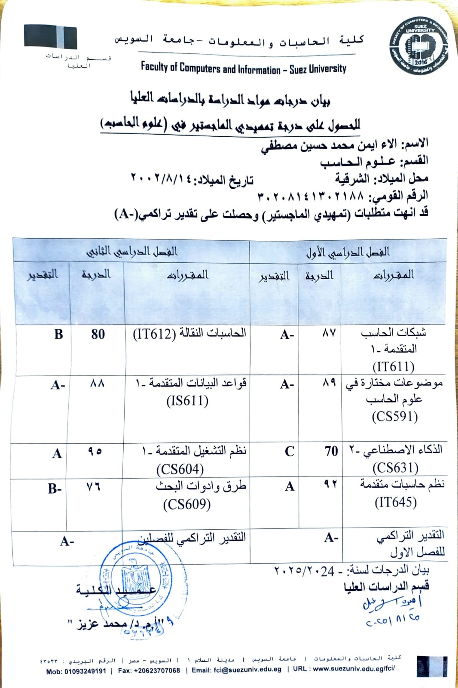

# 🎓 Pre-Master Milestone Unlocked

---

📜 Here’s my certificate:  

---

I’m happy to share that I’ve officially received my  
**Pre-Master Certificate in Computer Science – Suez University (2025)** 🎉  

This marks the first step in my master’s journey, and I can’t wait for what’s next! 🌱  

✨ Always learning, always growing ✨  

# 🎓 Pre-Master Milestone Unlocked! 🚀  

---

📜 Here’s my certificate:  

---

I’m happy to share that I’ve officially received my  
**Pre-Master Certificate in Computer Science – Suez University (2025)** 🎉  

This marks the first step in my master’s journey, and I can’t wait for what’s next! 🌱  

✨ Always learning, always growing ✨  

